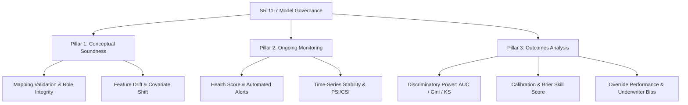

# Model Risk Management Expert Notes & Regulatory Framework

This document details the regulatory validation methodology, deterministic finding rules, and model governance architecture implemented in the ModelPulse platform. It reflects standards prescribed by the **Federal Reserve SR 11-7 / OCC 2011-12 (Supervisory Guidance on Model Risk Management)**, **CECL (ASC 326)**, and **IFRS 9**.

---

## 1. Regulatory Architecture & The Three Pillars (SR 11-7)

SR 11-7 defines model risk as the potential for adverse consequences from decisions based on incorrect or misused model outputs. ModelPulse enforces the three core elements of effective model governance:

### Pillar 1: Conceptual Soundness
* **Data Ingestion & Profiling**: Automated detection of null rates, extreme cardinality, constant columns, and duplicate records.
* **Role Mapping Guardrails**: Enforcing assignment of critical roles (`record_id`, `prediction_score`, `target`, `decision`, `event_time`, `protected_class`) before execution.

### Pillar 2: Ongoing Monitoring
* **Composite Health Scoring**: Weighted evaluation of discrimination, calibration, and stability.
* **Early Warning Thresholds**: Two-tier alerting (`warning` and `critical`) based on absolute and baseline-relative decline.

### Pillar 3: Outcomes Analysis
* **Backtesting & Discrimination**: Verifying that ranking ability remains statistically sound over time.
* **Underwriter Override Analysis**: Isolating discretionary human overrides to quantify underwriter versus model risk.

---

## 2. Deterministic Findings Engine Rules

To prevent hallucinations and guarantee auditable consistency, findings are generated by a deterministic rule engine before being contextualized by the LLM:

### 1. Inverted Rank Ordering
* **Trigger**: $\text{AUC} < 0.50$ (when score direction is `higher_is_better`).
* **MRM Meaning**: Model has completely reversed its discriminatory power. Good applicants are scored as bad, and high-risk applicants receive favorable scores. Requires immediate model suspension.

### 2. Quiet Decay
* **Trigger**: AUC or Gini experiences a persistent drop ($\Delta \text{AUC} \ge 0.02$) over multiple observation periods while staying marginally above the critical cutoff.
* **MRM Meaning**: Upstream covariate shift or changing macroeconomic conditions are slowly eroding discriminatory power before traditional thresholds trip.

### 3. Selection Bias & Reject Inference Caveat
* **Trigger**: Model has an `approval_rate` $< 85\%$ with observed outcomes available only on accepted loans.
* **MRM Meaning**: Performance metrics (AUC/Gini) suffer from sample selection bias (censored data). Performance on the overall population may be significantly lower than observed on booked loans.

### 4. Score-PD Incoherence
* **Trigger**: Disagreement between assigned model score rank and estimated Probability of Default (PD) rank (Spearman rank correlation $< 0.85$).
* **MRM Meaning**: The scoring algorithm and the calibration mapping are misaligned, creating conflicting credit decisions.

### 5. Non-Monotonic Score Bands (Band Inconsistency)
* **Trigger**: Observed default rates do not increase monotonically across deteriorating score tiers.
* **MRM Meaning**: Risk bucket definitions are unstable, indicating localized over-fitting or erratic behavior in specific borrower segments.

### 6. Adverse Human Override Performance
* **Trigger**: Positive underwriter override bad rate $\ge 1.5\times$ model approval bad rate, or positive override rate $> 10\%$.
* **MRM Meaning**: Human discretionary overrides are systematically degrading credit quality, demonstrating negative selection or underwriter bias.

### 7. Upstream Covariate Shift (Feature CSI Drift)
* **Trigger**: Individual feature Characteristic Stability Index (CSI) $\ge 0.25$ while overall score PSI remains below $0.10$.
* **MRM Meaning**: The applicant demographic or financial profile is drifting significantly, but offsetting feature correlations are temporarily masking overall score stability.

### 8. Disparate Impact / ECOA Proxy Violation
* **Trigger**: Disparate impact ratio $< 0.80$ on any protected class or segment proxy (Four-Fifths Rule).
* **MRM Meaning**: Potential violation of the Equal Credit Opportunity Act (ECOA) / Fair Housing Act. Requires immediate fair lending review and business necessity justification.

---

## 3. Generative AI Governance & Anti-Hallucination Pipeline

When LLM narratives are generated, ModelPulse employs a **Zero-Hallucination Citation Verifier**:
1. Every numeric scalar, percentage, and metric mentioned in the narrative text is extracted using regular expression parsers.
2. Each extracted number is checked against the set of verified numbers computed deterministically in `metrics.json`, `alerts.json`, `health.json`, and `stat_tests.json`.
3. If unverified claims are detected, the UI displays an unverified citations warning badge, and the claim is flagged in the audit trail.
